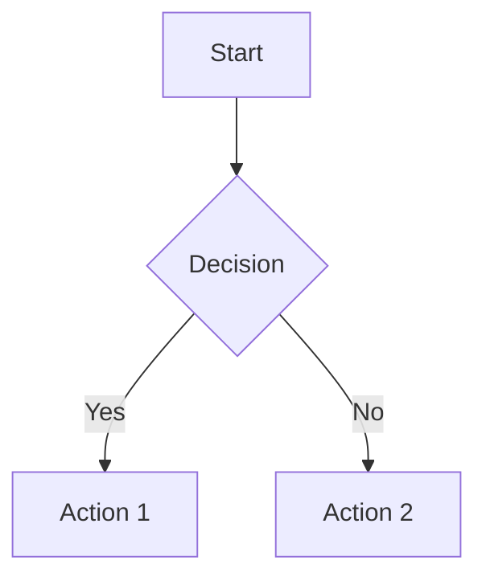

# Ram-Nants Thought Journal

A simple, clean notes app for capturing and organizing your innovative ideas and random thoughts with full Markdown and Mermaid diagram support.

🌐 **Live App:** [https://ram-nants.netlify.app](https://ram-nants.netlify.app)

## Features

- 📝 **Markdown Editor** - Write your thoughts with full Markdown support
- 📊 **Mermaid Diagrams** - Render flowcharts, sequence diagrams, and more
- 🔐 **Secure Authentication** - Firebase-powered user accounts
- ☁️ **Cloud Storage** - Your notes are saved and synced across devices
- 🌙 **Dark Theme** - Easy on the eyes for late-night brainstorming
- 📱 **Responsive Design** - Works on desktop and mobile
- 👁️ **Live Preview** - Toggle between editor and rendered markdown view

## Markdown Support

Your notes support full GitHub-flavored Markdown:

- **Headers** (`# H1`, `## H2`, `### H3`)
- **Bold** (`**text**`) and *Italic* (`*text*`)
- **Lists** (ordered and unordered)
- **Code blocks** with syntax highlighting
- **Links** and **Images**
- **Tables**

### Mermaid Diagrams

Create beautiful diagrams using Mermaid syntax:

~~~markdown

~~~

Supported diagram types:
- Flowcharts
- Sequence diagrams
- Class diagrams
- State diagrams
- And more!

## Getting Started

### Prerequisites

- Node.js 18+
- Firebase account

### Installation

1. Clone the repository
```bash
git clone <your-repo-url>
cd nextjs-15-course
```

2. Install dependencies
```bash
npm install
```

3. Set up environment variables
Create a `.env.local` file with your Firebase configuration:
```env
NEXT_PUBLIC_FIREBASE_APIKEY=your_api_key
NEXT_PUBLIC_FIREBASE_AUTHDOMAIN=your_auth_domain
NEXT_PUBLIC_FIREBASE_PROJECTID=your_project_id
NEXT_PUBLIC_FIREBASE_STORAGEBUCKET=your_storage_bucket
NEXT_PUBLIC_FIREBASE_MESSAGINGSENDERID=your_sender_id
NEXT_PUBLIC_FIREBASE_APPID=your_app_id
```

4. Run the development server
```bash
npm run dev
```

Open [http://localhost:3000](http://localhost:3000) to start journaling your thoughts.

## Usage

1. **Sign Up/Login** - Create an account or log in to access your notes
2. **Create Notes** - Click "New Note" and start writing
3. **Save Automatically** - Your thoughts are saved as you type
4. **Organize** - Browse through your previous entries

## Built With

- [Next.js 16](https://nextjs.org/) - React framework
- [Firebase](https://firebase.google.com/) - Authentication and database
- [markdown-to-jsx](https://www.npmjs.com/package/markdown-to-jsx) - Markdown rendering
- [Mermaid](https://mermaid.js.org/) - Diagram rendering
- [Fanta.css](https://github.com/jamezmca/fantacss) - Custom styling

## License

This project is open source and available under the [MIT License](LICENSE).

---

*Start capturing your ram-nants (random thoughts) today!* 💭